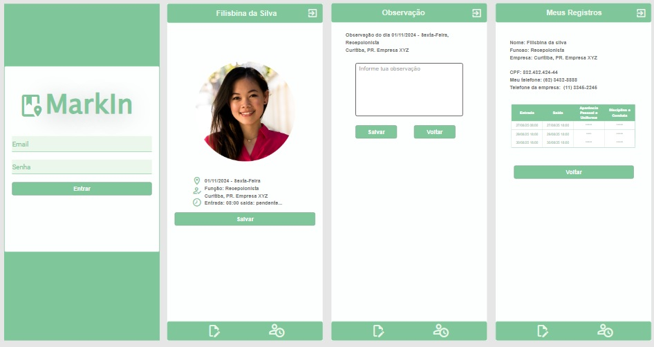
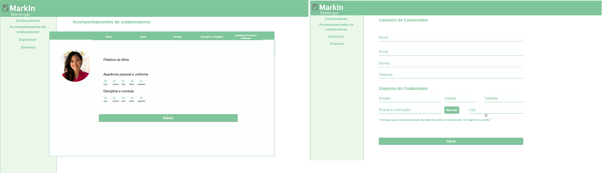

# MarkIn
O monitoramento diário da apresentação e postura individual dos colaboradores que interagem diretamente com o público ganha importância crescente. Empresas que prestam serviços de atendimento presencial buscam garantir que seus colaboradores estejam preparados e bem apresentados para atender a diversos clientes.

[Ir para Requisitos](https://github.com/antoniotavares20/MarkIn/wiki/Requisitos-Sup)
 
# Protótipo
 

 

### Plataforma Móvel
[Link para o Protótipo Móvel](https://app.quant-ux.com/#/test.html?h=a2aa10at2FJGngZd918Dzn5ozmy4uSkvQ826tUrSoxtemcydtADszzkvyrZm&ln=en)

### Dashboard
[Link para o Dashboard](https://app.quant-ux.com/#/test.html?h=a2aa10aaWvyL2UATj4UJcvRtKoLjORp5xiHWGlMhZT3KKjOx5VBsTQpdgDEm&ln=en)
